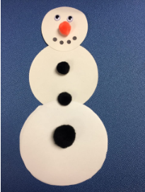
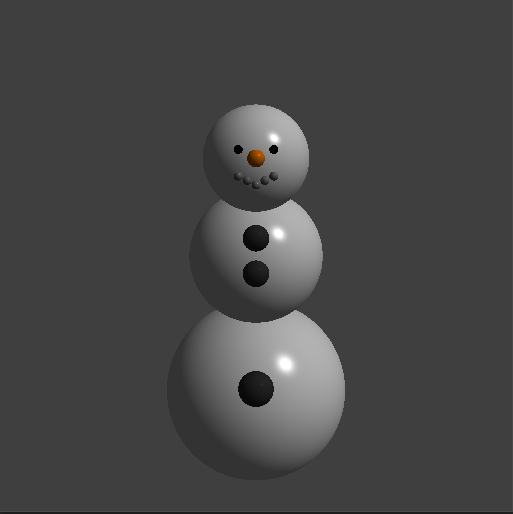

# RAYTRACER_1

## Instrucciones 

Para obtener la nota completa de ésta tarea deben entregar lo siguiente:

--> Código fuente capaz de renderizar esferas por medio de un Ray Intersect Algorithm.
 
 
--> Usar un modelo de iluminación Phong.
 
 
--> El programa principal debe mostrar la siguiente figura (o lo más cercano posible) en pantalla o en un BMP:
 
 

## Output obtenido
Mediante la implementación del código visto en clase se pudo obtener la construccion del siguiente modelo:
 
 

